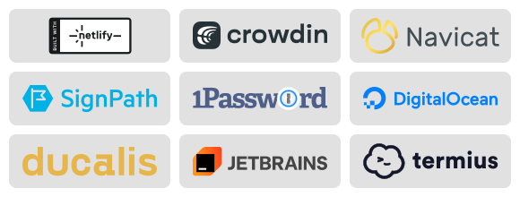

  

<h1 align="center">Snap Hutao</h1>

  🎮 开源的原神工具箱，专为 Windows 平台设计，改善桌面端玩家的游戏体验  
   
  🎮 An open-source Genshin Impact toolkit for Windows, designed to improve the desktop gaming experience

  <table>
    <tr>
      <td align="center" style="padding:0 10px;">
        <b>Latest CI/CD Build
      </td>
      <td align="center" style="padding:0 10px;">
        <b>Latest Release
      </td>
      <td align="center" style="padding:0 10px;">
        <b>Downloads
      </td>
    </tr>
    <tr>
      <td align="center" style="padding:0 10px;">
        
      </td>
      <td align="center" style="padding:0 10px;">
        
      </td>
      <td align="center" style="padding:0 10px;">
        
      </td>
    </tr>
  </table>

---

## 📖 简介 / Introduction

**中文**  
胡桃工具箱是一款以 MIT 协议开源的原神工具箱，专为现代化 Windows 平台设计，旨在改善桌面端玩家的游戏体验。通过将既有的官方资源与开发团队设计的全新功能相结合，提供了一套完整且实用的工具集，且无需依赖任何移动设备。它不对游戏客户端进行任何破坏性修改以确保工具箱的安全性。  

**English**  
Snap Hutao is an open-source Genshin Impact toolkit under MIT license, designed for modern Windows platform to improve the gaming experience for desktop players. By combining existing official resources with new features designed by the development team, it provides a complete and useful set of tools without the need to rely on mobile devices. Snap Hutao does not take any destructive modification to the game client to ensure the security of the toolkit.  

---

## 🚀 安装 / Installation

**中文**  
你可以按照 [快速开始](https://hut.ao/zh/quick-start.html) 文档中提供的流程安装并设置 Snap Hutao。  

**English**  
You can follow the instructions in the [Quick Start](https://hut.ao/en/quick-start.html) document to install and set up Snap Hutao.  

---

## 🌍 本地化翻译 / Localization

Snap Hutao 使用 [Crowdin](https://translate.hut.ao/) 作为客户端文本翻译平台，在该平台上你可以为你熟悉的语言提交翻译文本。我们感谢每一个为 Snap Hutao 做出贡献的社区成员，并且欢迎更多的朋友能参与到这个项目中。  

Snap Hutao uses [Crowdin](https://translate.hut.ao/) as a client text translation platform where you can submit translated text for languages you are familiar with. We are grateful to every community member who has contributed to Snap Hutao and welcome more friends to participate in this project.  

| Language | Status |  
|----------|--------|  
| zh-TW |  |  
| en |  |  
| fr |  |  
| id |  |  
| ja |  |  
| ko |  |  
| pt-PT |  |  
| ru |  |  
| vi |  |  

---

## 🤝 社区 / Community

- 💬 [Discord](https://discord.gg/CcH5XtDtvR)  
- 💬 [QQ 群: 567908135](https://qm.qq.com/q/WJKykrY9W)  

---

## 🛠️ 贡献 / Contribute

- [向我们提交 PR / Make Pull Requests](https://hut.ao/development/contribute.html)  
- [为我们更新文档 / Enhance our Document](https://github.com/DGP-Studio/Snap.Hutao.Docs)  
- [通过 DeepWiKi 了解项目结构 / Understand Project Structure with DeepWiKi](https://deepwiki.com/DGP-Studio/Snap.Hutao)  
  -   

---

## 🙏 特别感谢 / Special Thanks

- [HolographicHat](https://github.com/HolographicHat)  
- [UIGF organization](https://uigf.org)  

**特定的原神项目 / Specific Genshin-related Projects**  
- [Scighost/Starward](https://github.com/Scighost/Starward)  

---

## ⚙️ 使用的技术栈 / Tech Stack

- [CommunityToolkit/dotnet](https://github.com/CommunityToolkit/dotnet)  
- [CommunityToolkit/Labs-Windows](https://github.com/CommunityToolkit/Labs-Windows)  
- [CommunityToolkit/Windows](https://github.com/CommunityToolkit/Windows)  
- [dotnet/efcore](https://github.com/dotnet/efcore)  
- [dotnet/runtime](https://github.com/dotnet/runtime)  
- [DotNetAnalyzers/StyleCopAnalyzers](https://github.com/DotNetAnalyzers/StyleCopAnalyzers)  
- [microsoft/vs-validation](https://github.com/microsoft/vs-validation)  
- [microsoft/WindowsAppSDK](https://github.com/microsoft/WindowsAppSDK)  
- [microsoft/microsoft-ui-xaml](https://github.com/microsoft/microsoft-ui-xaml)  
- [quartznet/quartznet](https://github.com/quartznet/quartznet)  

---

## 🔗 支撑项目 / Supporter Project

- [Snap.Hutao.Server](https://github.com/DGP-Studio/Snap.Hutao.Server)  
- [Snap.Metadata](https://github.com/DGP-Studio/Snap.Metadata)  

---

## ❤️ 赞助商 / Sponsorship

Snap Hutao is currently using sponsored software from the following service providers.  

- 🏠 [Netlify](https://www.netlify.com/) provides document and home page hosting service for Snap Hutao  
- 🌍 [Crowdin](https://crowdin.com/) provides its SaaS platform to help Snap Hutao's localization  
- 🗄️ [Navicat](https://navicat.com/) provides Snap Hutao with advanced database management tools  
- 🔒 Free code signing provided by [SignPath.io](https://signpath.io/), certificate by [SignPath Foundation](https://signpath.org/)  
- 🔑 [1Password](https://1password.com/) provides Snap Hutao development team with their amazing password management software  
- 🐳 [DigitalOcean](https://www.digitalocean.com) provides reliable cloud database and container service for Snap Hutao database backup  
- 📊 [Ducalis.io](https://hi.ducalis.io/) provides Snap Hutao project with a complete decision-making toolkit for project management  
- ☁️ [Cloudflare](https://www.cloudflare.com/) sponsors Snap Hutao with their Business Plan, ensuring secure, fast, and reliable worldwide connection to our infrastructure  
- 🔐 [Termius](https://termius.com) provides a secure, reliable, and collaborative SSH client  

---

## 📈 开发 / Development

  

  
