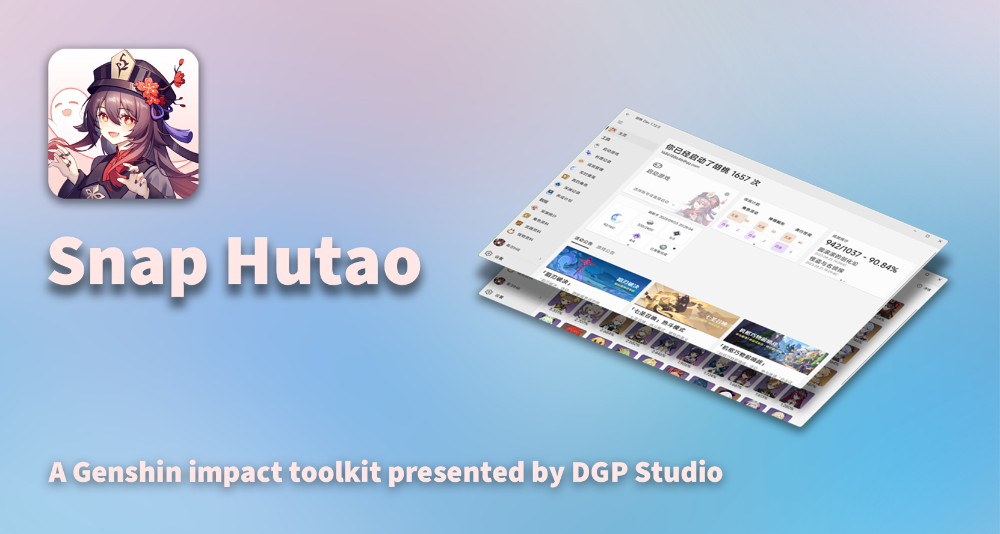

胡桃工具箱是一款以 MIT 协议开源的原神工具箱，专为现代化 Windows 平台设计，旨在改善桌面端玩家的游戏体验。通过将既有的官方资源与开发团队设计的全新 功能相结合，它提供了一套完整且实用的工具集，且无需依赖任何移动设备。它不对游戏客户端进行任何破坏性修改以确保工具箱的安全性

Snap Hutao is an open-source Genshin Impact toolkit under MIT license, designed for modern Windows platform to improve the gaming experience for desktop players. By combining existing official resources with new features designed by the development team, it provides a complete and useful set of tools without the need to rely on mobile devices. Snap Hutao does not take any destructive modification to the game client to ensure the security of the toolkit.

## 下载使用 / Download

## 贡献 / Contribute

* [向我们提交 PR / Make Pull Requests](https://github.com/DGP-Studio/Snap.Hutao/pulls)
* [在 Crowdin 上进行本地化 / Translate Project on Crowdin](https://translate.hut.ao/)
* [为我们更新文档 / Enhance our Document ](https://github.com/DGP-Studio/Snap.Hutao.Docs)

## 特别感谢 / Special Thanks

* [HolographicHat](https://github.com/HolographicHat)
* [UIGF organization](https://uigf.org)

### 特定的原神项目 / Specific Genshin-related Projects

* [biuuu/genshin-wish-export](https://github.com/biuuu/genshin-wish-export)
* [xunkong/xunkong](https://github.com/xunkong/xunkong)
* [YuehaiTeam/cocogoat](https://github.com/YuehaiTeam/cocogoat)

### 使用的技术栈 / Tech Stack

* [CommunityToolkit/dotnet](https://github.com/CommunityToolkit/dotnet)
* [CommunityToolkit/Labs-Windows](https://github.com/CommunityToolkit/Labs-Windows)
* [CommunityToolkit/Windows](https://github.com/CommunityToolkit/Windows)
* [dahall/taskscheduler](https://github.com/dahall/taskscheduler)
* [dotnet/efcore](https://github.com/dotnet/efcore)
* [dotnet/runtime](https://github.com/dotnet/runtime)
* [DotNetAnalyzers/StyleCopAnalyzers](https://github.com/DotNetAnalyzers/StyleCopAnalyzers)
* [microsoft/CsWin32](https://github.com/microsoft/CsWin32)
* [microsoft/vs-validation](https://github.com/microsoft/vs-validation)
* [microsoft/WindowsAppSDK](https://github.com/microsoft/WindowsAppSDK)
* [microsoft/microsoft-ui-xaml](https://github.com/microsoft/microsoft-ui-xaml)

### 支撑项目 / Supporter Project

* [Snap.Hutao.Server](https://github.com/DGP-Studio/Snap.Hutao.Server)
* [Snap.Metadata](https://github.com/DGP-Studio/Snap.Metadata)

## 开发 / Development

