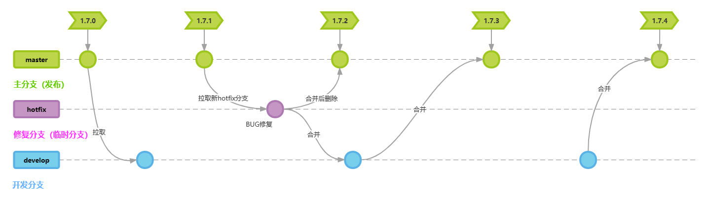

胡桃工具箱是一个 Windows 平台的开源的原神工具箱，旨在帮助玩家获得更好的游戏体验； 它是对官方移动端工具的一种非破坏性功能扩展，为不习惯在移动端进行原神游戏的 PC 玩家提供一个在 Windows 平台下获得接近移动端功能权利的途径

Snap Hutao is an open-source Genshin Impact toolbox on Windows platform, aim to provide a better gaming experience for players. It's an nondestructive feature extension from Genshin Impact's official mobile application, to provide similar feature on desktop, to allow PC gamers gain deserved benefits from mobile platforms.

## 下载使用 / Download

## 贡献 / Contribute

* [向我们提交 PR / Make Pull Requests](https://github.com/DGP-Studio/Snap.Hutao/pulls)
* [在 Crowdin 上进行本地化 / Translate project on Crowdin](https://translate.hut.ao/)
* [为我们更新文档 / Enhance our Document ](https://github.com/DGP-Studio/Snap.Hutao.Docs)

## 特别感谢 / Special Thanks

* [HolographicHat](https://github.com/HolographicHat)
* [UIGF organization](https://uigf.org)

### 特定的原神项目 / Specific Genshin-related Project

* [biuuu/genshin-wish-export](https://github.com/biuuu/genshin-wish-export)
* [xunkong/xunkong](https://github.com/xunkong/xunkong)
* [YuehaiTeam/cocogoat](https://github.com/YuehaiTeam/cocogoat)

### 使用的技术栈 / Tech Stack

* [CommunityToolkit/dotnet](https://github.com/CommunityToolkit/dotnet)
* [CommunityToolkit/Labs-Windows](https://github.com/CommunityToolkit/Labs-Windows)
* [CommunityToolkit/Windows](https://github.com/CommunityToolkit/Windows)
* [dahall/taskscheduler](https://github.com/dahall/taskscheduler)
* [dotnet/efcore](https://github.com/dotnet/efcore)
* [dotnet/runtime](https://github.com/dotnet/runtime)
* [DotNetAnalyzers/StyleCopAnalyzers](https://github.com/DotNetAnalyzers/StyleCopAnalyzers)
* [microsoft/CsWin32](https://github.com/microsoft/CsWin32)
* [microsoft/vs-validation](https://github.com/microsoft/vs-validation)
* [microsoft/WindowsAppSDK](https://github.com/microsoft/WindowsAppSDK)
* [microsoft/microsoft-ui-xaml](https://github.com/microsoft/microsoft-ui-xaml)

### 支撑项目 / Supporter Project

* [Snap.Hutao.Server](https://github.com/DGP-Studio/Snap.Hutao.Server)
* [Snap.Metadata](https://github.com/DGP-Studio/Snap.Metadata)

## 开发 / Development

